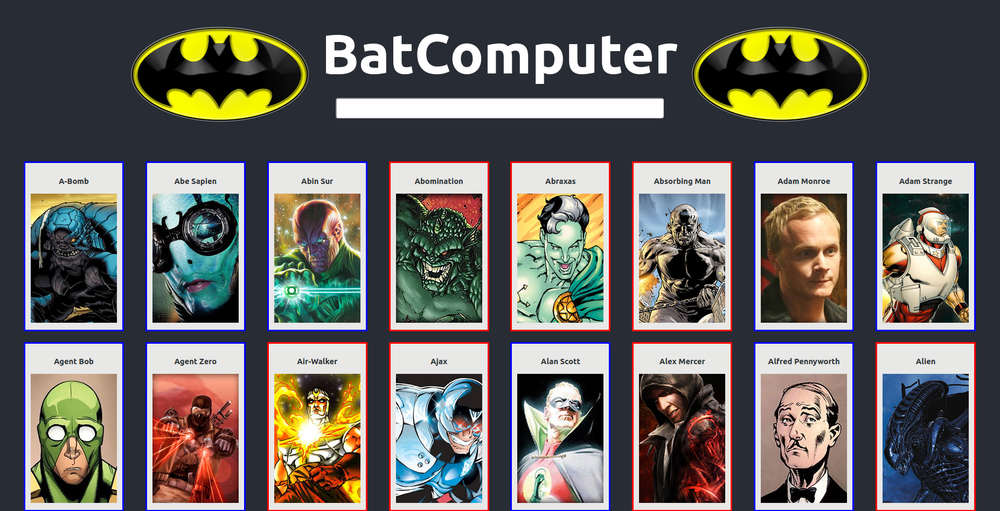

> This project is a React based catalog built is the capstone project for the Microverse React module coursework. It is meant to emulate the Bat Computer's resource cataloging stats of both Heros and Villians.

## Project Description

The project is a react catalog app designed to display resources fetched from an API. It fetches a list of Superheroes and Supervillians that can be filtered by name and displays data upon click selection.

#### Features
-   Lists Heroes and Villians from throughout the MultiVerse
-   Easy searching by typing into the search bar.
-   Return to catalog display by clicking a bat symbol or typing into the input bar.
-   Dynamic URL creation displays the name of the selection as an extension of the webpage url
-   Image border displays Blue for Heroes
-   Image border displays Red for Villians

###### Coming Features
-   Enhanced search filters
-   Increased catalog inventory

## Built With
-   Atom
-   Ubuntu
-   Node.js / npm 
-   React / React-DOM / Redux
-   React-Create-App
-   JavaScript ES6 / HTML / CSS

### To Use;
-   To look for a character, simply scroll down or begin a search
-   Searches do not begin with the first letter of a character's name, for example typing 'star' would return both Firestar and Star-Lord
-   Clicking on a character card will display the stats of that character
-   Clicking the bat symbol will return your search to the full directory of characters
-   Typing into the search bar will continue a search of the full directory, even from the character stats display page

## Live Demo
  
Try it out [here](https://batcomputer.netlify.app)
#### Deployed on: Netlify

## Getting Started Locally

### Prerequisities
To get this project up and running locally, you must have node and npm installed on your computer.

**To get this project set up on your local machine, follow these simple steps:**

**Step 1** 
Navigate to the local folder where you want the repository to be cloned and run
`git clone https://github.com/defoebrand/react-catalog.git`. 

**Step 2** 
Next, run `cd react-catalog`. 

**Step 3** 
Run `npm start` to begin the server. 

**Step 4** 
Navigate to `http://localhost:3000/` in a browser of your choice to see the application running 

### Testing
This project uses Jest for testing.
> To run tests open a terminal inside the project's root directory and enter `npm test`

## Authors

👤 **Brandon Defoe**

-   Portfolio: [defoebrand](https://www.defoebrand.com)
-   Github: [@defoebrand](https://github.com/defoebrand)
-   LinkedIn: [@defoebrand](https://www.linkedin.com/in/defoebrand/)
-   Gmail: <mailto:defoe.brand@gmail.com>

## 🤝 Contributing

Our favorite contributions are those that help us improve the project, so please leave an issue or a feature request if you have any suggestions!

Feel free to check the [issues page](https://github.com/defoebrand/react-catalog/issues) to either create an issue or help us out by fixing an existing one.

## Show your support

If you've read this far....give us a ⭐️!

## :clap: Acknowledgements

-   Microverse
-   [Marc-Antoine Roy on Behance](https://www.behance.net/enfantroy)
-   Batman™ is property of [DC](https://www.dccomics.com/copyright)
-   [Superhero-api](https://akabab.github.io/superhero-api/) as provided by [akabab](https://github.com/akabab)

## 📝 License

This project is licensed by Microverse
